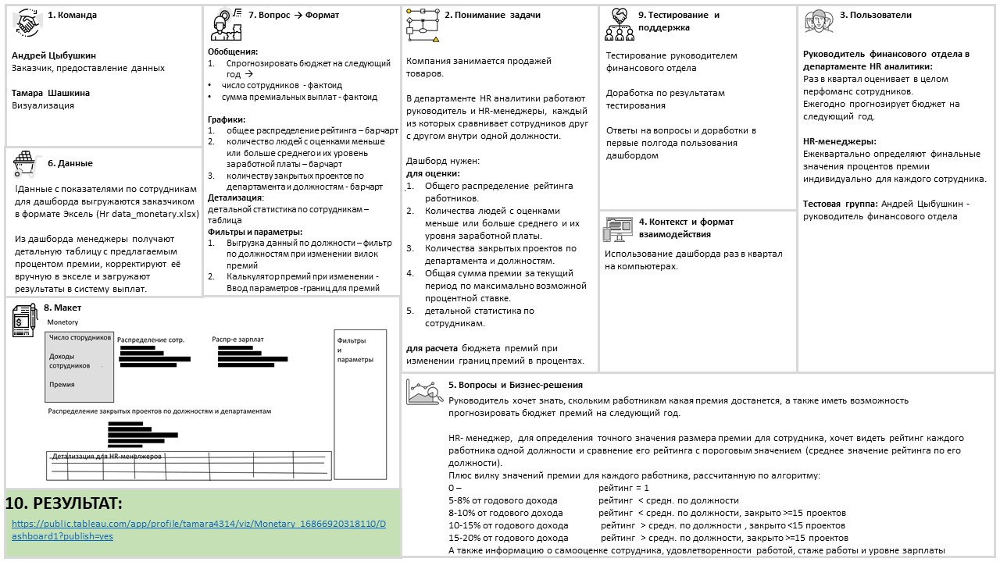
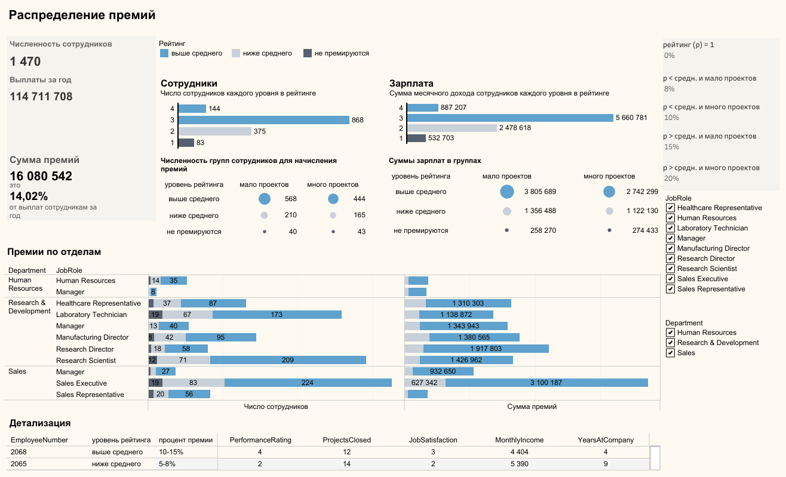

# Система распределения премий
Проект создания дашборда, отражающего систему распределения премий для сотрудников с использованием Tableau.

### Контекст

Руководитель HR-отдела хочет знать, скольким работникам какая премия достанется, а также иметь возможность прогнозировать бюджет премий на следующий год.
Необходимо конкретизировать требования и реализовать дашборд с изменяемыми параметрами.

### Стек проекта

## Решение

### Шаг1

Провела интервью с заинтересованным лицом, составила документ с требованиями к дашборду:

    

### Шаг2

Разработала дашборд с учетом требований пользователей, содержащий:
* оценку общих затрат на выплату премий сотрудникам,
* возможность анализа показателей по отделам,
* детальную информацию по каждому работнику,
* изменяемые параметры для оценки бюджета премий на следующий год.

## Результат 
 
 

    

  <a href="https://public.tableau.com/app/profile/tamara4314/viz/Monetary_16866920318110/Dashboard1#1">
  Monetary
  </a> 
 
  
